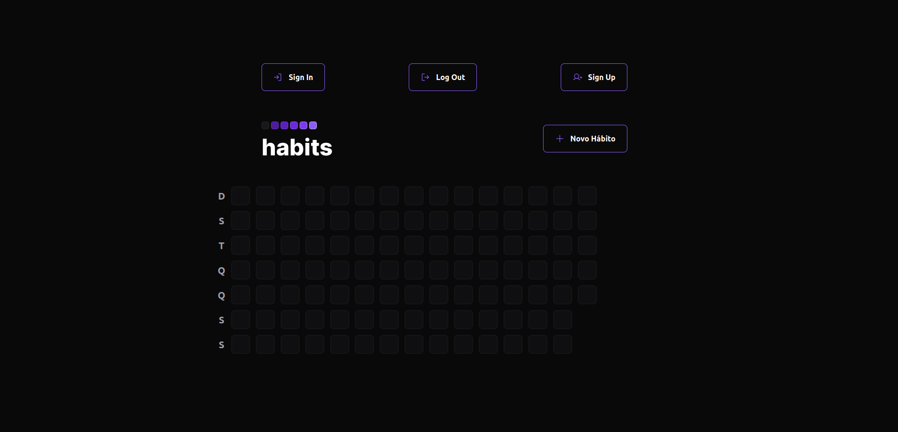

# Nlw Setup

## O que é esse repositório?

Esse repositório foi criado com o intuito de criar um projeto de controle de hábitos do zero utilizando React, Node.js e React Native, todos com Typescript também.

## Imagens do projeto

Atualmente (23/01/2023), o projeto está assim. A ideia, entretanto, é fazer uma landing page onde o usuário poderá logar/se cadastrar e, a partir daí, a tela de hábitos será mostrada.



## Funções criadas no projeto

- Web
  - [x] Sumário com resumo de todos os hábitos do ano
  - [x] Criação de novo hábito
  - [x] Verificar os hábitos de determinado dia (somente dias anteriores ao dia atual)
  - [x] Marcar os hábitos completos no dia (somente no dia atual)
  - [ ] Login, logout e signin
  - [ ] Página de perfil de usuário
  - [ ] Separação das páginas enquanto logado/deslogado

- Server
  - [x] Rotas de "Criar hábito" e "toggle hábito"
  - [x] Rota para pesquisar todos os hábitos
  - [x] Rota para trazer hábitos específicos de um dia
  - [ ] Rota para deletar hábito (somente hábitos que estão disponíveis no dia)
  - [ ] Separação de hábitos por usuário


- Mobile
```js 
// vou adicionar a parte mobile depois, quando aproveitar pra tirar umas fotos e relembrar tudo que produzi dentro dele. 
```


## Bibliotecas / tecnologias usadas

- Typescript
- npm

- Web
  - Axios 
  - Clsx
  - Dayjs
  - Firebase
  - Phospor React
  - Radix-ui
  - Tailwindcss
  - Vite


- Server
  - Dayjs
  - Fastify
  - Prisma
  - Prisma erd generator
  - Zod

- Mobile
  - Dayjs
  - Expo
  - Clsx
  - Nativewind
  - Google fonts
  - Axios
  - React Native reanimated
  - React Native svg